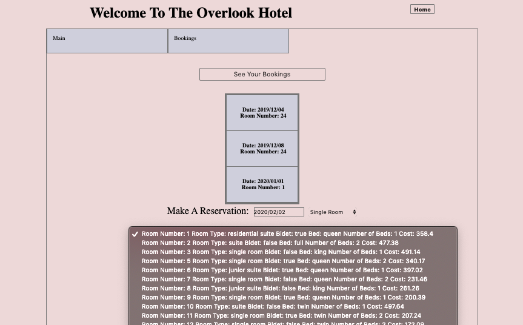

# OverLook

## Overview:
  The OverLook is a hotel booking app. There are two ways to enter the app, either as a customer or an administrator. The customer is only able to view information about them selves while the admin has control over all the OverLooks information. With this app you have the ability to book rooms through an API and filter the different types of room features you would like. Make bookings, check how much you have spent, or see how many rooms are filled on a given day.
  
## Setup
 You can clone down this repo and run: `npm install`

To verify that it is setup correctly, run `npm start` in your terminal. Go to `http://localhost:8080/` and you should see a page with "Welcome to the OverLook"

## Tech Stack
  - Javascript 
  - CSS / Scss / HTML
  - Mocha / Chai testing library 
  - Webpack
  - Web APIs
  
## Challenges and Wins: 
  - Challenges: There was a lot of DOM manipulation for this app and it proved hard to populate the information in an orderly fasion. Testing for DOM events was also a challenge, making sure that all the data was reaching the API correctly. 
  - Wins: Working with the fetch API and taking in the data correctly. Using a class structure that features inheritence.
  
## Screenshots: 

